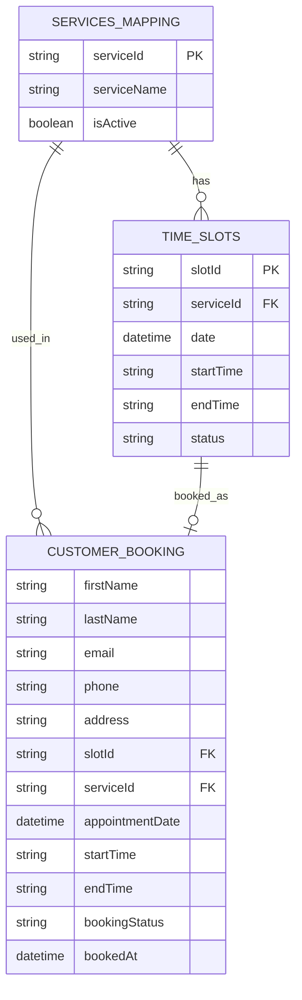

```mermaid
erDiagram
    SERVICES_MAPPING ||--o{ TIME_SLOTS : has
    SERVICES_MAPPING ||--o{ CUSTOMER_BOOKING : used_in
    TIME_SLOTS ||--o| CUSTOMER_BOOKING : booked_as

    SERVICES_MAPPING {
        string serviceId PK
        string serviceName
        boolean isActive
    }

    TIME_SLOTS {
        string slotId PK
        string serviceId FK
        datetime date
        string startTime
        string endTime
        string status
    }

    CUSTOMER_BOOKING {
        string firstName
        string lastName
        string email
        string phone
        string address
        string slotId FK
        string serviceId FK
        datetime appointmentDate
        string startTime
        string endTime
        string bookingStatus
        datetime bookedAt
    }
```
