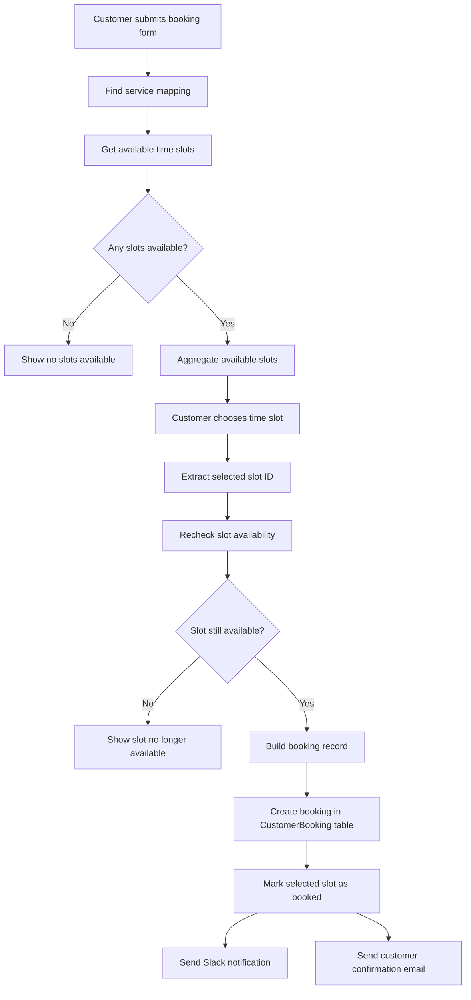

# Service Booking Workflow Map

```mermaid
flowchart TD

A[Customer submits booking form] --> B[Find service mapping]

B --> C[Get available time slots]

C --> D{Any slots available?}

D -->|No| E[Show no slots available]
D -->|Yes| F[Aggregate available slots]

F --> G[Customer chooses time slot]

G --> H[Extract selected slot ID]

H --> I[Recheck slot availability]

I --> J{Slot still available?}

J -->|No| K[Show slot no longer available]
J -->|Yes| L[Build booking record]

L --> M[Create booking in CustomerBooking table]

M --> N[Mark selected slot as booked]

N --> O[Send Slack notification]
N --> P[Send customer confirmation email]
```
